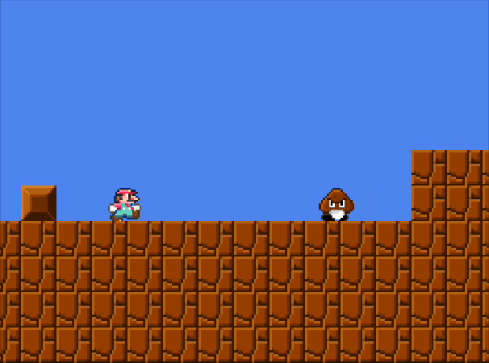
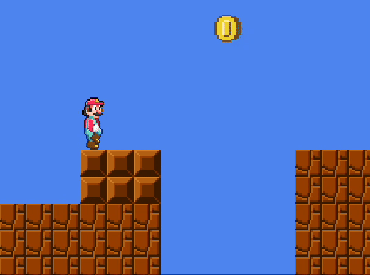

.docname {Pixformer}
.docauthor {Giorgio Garofalo}
.doclang {English}
.doctype {slides}
.theme layout:{latex}
.autopagebreak maxdepth:{2}
.pageformat alignment:{center}
.slides center:{yes}

.pagemargin {bottomrightcorner}
	.currentpage / .totalpages

#! Pixformer 

.text {A multiplayer **Super Mario Bros.** clone} size:{larger}

https://github.com/iamgio/distributed-pixformer

---

.docauthor  
Distributed Systems, A.Y. 2024-2025 @ Unibo  

# The game

!(80%)[](../report/img/screenshots/game2.png)

## Enemies

.row alignment:{spaceevenly}
	!(50px)[Goomba](img/sprites/goomba.png "Goomba")
	
	.column
		!(50px)[Koopa](img/sprites/koopa.png "Koopa")
		
		!(50px)[Koopa shell](img/sprites/koopa_shell.png "Koopa in its shell")
		
## Power-ups

!(40px)[Default state](img/sprites/mario_small_jump.png "Default state")

.grid columns:{2} alignment:{center} gap:{1cm}
	!(40px)[Mushroom](img/sprites/mushroom.png "Mushroom")
	
	!(40px)[Mushroom state](img/sprites/mario_big_jump.png)
	
	!(50px)[Flower](img/sprites/flower.png "Fire Flower")
	
	!(40px)[Flower state](img/sprites/mario_flower_jump.png)

# Game over

.row gap:{1cm}
	

	

# Success

!(60%)[Success](img/gif/pole.gif)

# Demo

# Architecture

.row cross:{start}
	!(75%)[Infrastructure](../report/img/component-uml/infrastructure.svg)
	
	.container margin:{40px 0 0 -50px}
		- ***Leader-follower* pattern**: one client overlaps with the game server, becoming the *leader*.
		- The **Game Finder Server** acts like a DDNS, mapping active game names to their server address.

# Interaction

## Game finding

When a client chooses a level to play, the game finder server is reached to look for any active
games on the same level,  
or to create one otherwise.

!(55%)[Game finding](../report/img/sequence-uml/gamefinder.svg)

## Handshake

On join, the client waits to be assigned a player index from the server.  
When the handshake is complete, the persistent WebSocket session is kept active.

!(50%)[Handshake](../report/img/sequence-uml/handshake.svg)

## User input

The system adopts a ***client-side prediction and server reconciliation*** pattern,  
prioritizing **availability over consistency** for a smooth user experience.

.row cross:{start}
	!(1200px)[User input](../report/img/sequence-uml/input.svg)
	
	- The client processes user inputs immediately, sending them to the server;
	- The server updates its internal game state and blindly forwards the message to all other clients,
	  which update their game state as well.
	- The message format is `n|action`, with `n` being the player index.  
	  Example: `2|jump`.

## Game state reconciliation

Each client periodically sends a reconciliation request to the server, to ensure consistency is kept.  
When the state is received, the internal game state is updated.

!(70%)[Reconciliation](../report/img/sequence-uml/reconciliation.svg)

<<<

.row gap:{2.5cm}
	.container alignment:{start}
		###! Game state reconciliation
		
		Sample game state shared from server to client

	```json
	{
	  "name": "Level 1",
	  "spawnPointX": 5,
	  "spawnPointY": 2,
	  "scores": {
	    "1": {
	      "points": 2,
	      "coinsNumber": 10
	    },
	    "2": {
	        "points": 5,
	        "coinsNumber": 20
	      }
	  },
	  "entities": [
	    {
	      "type": "player",
	      "x": 5.0,
	      "y": 2.0,
	      "velocity": {
	        "x": 0.1,
	        "y": 0.0
	      },
	      "playerIndex": 1,
	      "powerup": "Mushroom"
	    },
	    ...
	  ]
	}
	```